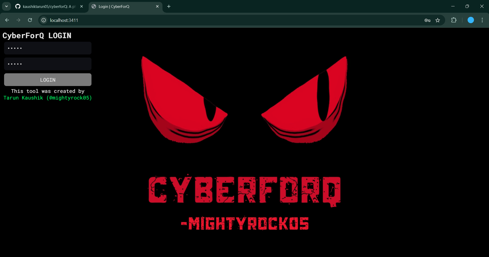

**ABSTRACT**

Increasing social networking sites result in an increase in phishing attacks. This demand calls for advanced tools created based on exploitation of weaknesses of authentication mechanisms. This dissertation introduces the Best Automatic Social Media Phishing Tool that collects and persists critical user information such as usernames, passwords, email addresses, one-time passwords (OTPs), and bypassing two-factor authentication (2FA). The software will function on Windows, Mac and linux servers. This software has a very straightforward interface and facilitates the creation of targeted instances as well as custom response pages.

The objectives of the research will be to determine the capabilities of the tool in bypassing a number of authentication mechanisms such as username and password acquisition, acquisition of OTP, bypassing 2FA by scanning QR code, amongst others. The findings of the tool indicated successful downloads of cookies to permit unauthorized access into the account from other applications, capture screenshots of the pages within the headless environment of the browser, upload capabilities of cookie files for session persistence.

In comparison analysis of the phishing tools that are currently available, it was observed that while most of the tools focus on credential extraction, the various methodology applied in this tool improved its exploitation capacity in terms of social media vulnerability. This calls for security tightening measures in the social networking sites to protect users' information from such automated phishing attacks. 

**Keywords:** Phishing tool, Social media security bypass two-factor authentication, OTP retrieval, Username/Password acquisition, Cookie hijacking, Automated attacks, Cybersecurity vulnerabilities, Windows server application, Comparative analysis.

**LIST OF TABLES**

| Table No | Table Description | Page No |
| :---: | :---- | :---: |
| Table 1 | Comparison of Phishing Tools with *CyberForQ* | 15  |

**Chapter 1: INTRODUCTION**

This chapter provides an overview of the project, its objectives, and the motivation behind its development. It introduces the importance of phishing simulations and cookie analysis in cybersecurity and outlines the scope, significance, and relevance of the project in today’s digital landscape.

**1.1 Introduction and Problem Summary**

Social media has emerged as the most basic means of communication in this digital world, providing interface opportunities between billions of users around the world. However, the massive usage has simultaneously led to a catastrophic rise in cyber attacks, which not only include phishing attacks but also the acquisition of sensitive information. Phishing refers to deceptiveness designed to mislead users to reveal personal information, such as usernames, passwords and financial information, with the semblance of authenticity. The increasing sophistication of these attacks has revealed a major gap in the effectiveness of existing security measures, thus necessitating the development of more advanced tools that can exploit these vulnerabilities for the purposes of training and research.

This paper mainly focuses on the development of an automatic Social Media Phishing Tool for the collection of sensitive user information on social media platforms. This tool, in the process, lacks to bypass a number of security features including 2FA; it, therefore, raises great fears as to users' privacy and the protection of data. Through a systematic analysis of the tool's functionalities and their consequences on user security, this research aims to improve our understanding of phishing methodologies and the effectiveness of countermeasures already in place.

**1.2 Objectives and Purpose of the Project**

The development of an effective automated phishing tool that can easily extract and store confidential user information from social media websites with the help of testing the vulnerabilities available in their authentication methods forms the main aim of this research effort. The specific objectives of this dissertation are as follows:

* Tool Development: We have developed a phishing tool that will automate the collection of usernames, passwords, OTPs, and by passing 2FA mechanisms and also implement cookie hijacking .  
* Security Vulnerability Assessment: To confirm which means of authentication on social media are weak and can be exploited effectively to successfully phish.

  This process involves analyzing the collected data to track any patterns in user behavior and suggest potential improvements in the security practices.

* Comparative Analysis: This study aims to evaluate the newly developed tool against current phishing tools, emphasizing its distinctive characteristics and benefits in leveraging vulnerabilities within social media platforms.

**1.3 Scope of the Project**

The paper scope is comprehensive enough, dealing with lots of crucial themes dealing with the technological advancement of the phishing tool and its implications on cybersecurity:

* This design will embrace modern web technology, namely EJS, HTML, CSS, JavaScript, and Electron, that could run perfectly on Windows servers.  
* This study will focus on the leading social media sites that are most often used in phishing attacks, thus providing a detailed analysis of their security measures.  
* In collecting data, multiple methods such as cookie hijacking and automated response generation shall be put into use to facilitate unauthorized access.  
* The appliance shall be used for educational purposes to emphasize the weaknesses, but always in strict accordance with ethical standards generally.  
* This paper aims to enhance the knowledge of phishing techniques while casting some light on valuable improvement in the cybersecurity protocols for social media sites. The means through which it helps its ends are thus envisioned to help improve online security concerns rising from user accounts in the contemporary context.

**Chapter 2: Literature Survey** 

This chapter presents a comprehensive review of existing systems, tools, and research in the domain of phishing and cookie management.

**2.1 Contemporary/Established System**  
Discusses the capabilities and limitations of current tools and techniques for phishing simulation and cookie hijacking

**2.1.1 Review of the Current System**  
The recent phishing attacks assume different sophisticated tactics that exploit vulnerabilities from various social media sites, as well as other online platforms. By its essence, phishing is a form of deception whereby fraudulent people use the cover of legitimized institutions to cheat victims of their sensitive information such as log-in names and passwords as well as account balances. Among the counter phishing technologies available include traditional email filtering, MFA, and awareness programs with the aim of upgrading users' awareness of the potential threats.  
Phishing has been very different with time, and the methods applied now are quite extended as follows. The most common phishing is email phishing where cybercriminals pretend to send fraudulent emails from trusted sources. Most of these emails have links that take the victims to fake websites where they are asked to provide their login information. Spear Phishing Unlike the usual phishing attacks, spear phishing is made specifically on particular individuals or organizations using personalized information to enhance its success rate. This approach usually requires in-depth investigation on the victim to create convincing communications. Cybercriminals seem to utilize these social media applications like Facebook and Instagram and Twitter to modify phishing. For instance, they might create a fake login page or send a direct message that requires the credentials of individual users. Voice phishing (vishing) and SMS phishing (smishing) are techniques where attackers use phone calls or text messages to solicit sensitive information from victims.  
Although many security measures were in place, phishing techniques are constantly evolving with respect to their application, hence making all available systems ineffective. Advanced technologies, such as generative AI, are increasingly being adopted by cybercrooks to create highly sophisticated phishing messages. Such messages are hard to detect, and the users and traditional security measures find it even harder.

**2.1.2 Problems and Limitations of the Current System**  
Current anti-phishing systems uncover several important deficiencies that limit them from presenting an efficient service:

* Inadequate Detection Techniques: Conventional email filters and security software often depend on heuristic analysis and predefined signatures for detecting phishing attempts. However, such detection systems lag behind newer and more complex techniques used by attackers, such as AI-generated content.  
* User Vulnerability: Despite educational efforts, most users are still lacking the information on today's phishing methods, leaving them to potentially inadvertently become unknowing assistants in fraud schemes. Emotional exploitation often used in phishing attempts can cause users to take actions impulsively rather than verify the validity of a request.  
* Meager Scope for Multi-Factor Authentication (MFA): Although MFA is an additional layer of security, it's not totally fool-proofed. Even cyber-convicts have managed to break through the security net thrown by MFA with techniques such as SIM swapping or capturing OTPs through social engineering tactics.  
* Lack of Real-Time Threat Intelligence Integration: Most current systems fail to integrate feeds of real-time threat intelligence, which would provide instant information about new phishing threats and tactics. This failure limits the ability of organizations to respond promptly to new attack vectors.

Phishing strategies continue to grow more complex, as hybrid attacks incorporating several approaches combine the capabilities of voice phishing (vishing) followed by e-mail phishing to increase the difficulty of detection and response. Additionally, attackers increasingly use methods of social engineering that exploit trust relationship models among users, causing traditional security controls to be less able to prevent breaches.

To understand CyberforQ’s position in the landscape of phishing tools, a comparative analysis is performed based on criteria like 2FA bypass capabilities, GUI availability, and cookie management.

CyberforQ demonstrates superior capabilities, especially with its GUI panel and robust 2FA bypass engine, making it more user-friendly and versatile than its counterparts.

Table 1: Comparison of Phishing Tools with *CyberForQ*

| Feature | CyberforQ | SET | HiddenEye | Evilginx |
| ----- | ----- | ----- | ----- | ----- |
| 2FA Bypass | Advanced | Basic | Moderate | Advanced |
| GUI Panel | Yes  | No | No | No |
| Cookie Management | Advanced | Limited | Limited | Advanced |
| Windows Compatibility | Yes | Limited | Yes | Yes |
| Custom Responses | Yes | No | Yes | No |

**2.2 Requirements of the Designed System**

The proposed framework is aimed at addressing the shortcomings of existing phishing detection and mitigation schemes by particularly focusing on scenarios where cookies become susceptible to download. The defined core requirements are as follows:

**2.2.1 Functional Requirements**

Phishing Simulation Framework:  
Dynamically create phishing links through services like Cloudflare tunneling services.  
Host phishing pages, masquerading as legitimate ones, targeting cookie extraction.

Cookie Capture and Analysis:  
Collect cookies resulting from victim engagement on fraudulent websites.  
Enable scanning mechanisms that may scan the cookies extracted for session hijacking risks.

Real-time surveillance:  
Immediately alert administrators to the phishing activity.  
Monitor tunnel operations for detecting anomalous behaviors.

Report Generation:  
Present detailed analysis regarding users' interactions with phishing links.  
Discuss the vulnerabilities pertaining to cookies and their possible mitigations.

**2.2.2 Nonfunctional Requirements**

Scalability:  
The system should be able to run various phishing simulations at the same time to be tested.

Usability:  
Develop an intuitive interface to enable administrators to monitor phishing simulation activities and cookie data analysis.  
Educate people with interactive modules on how to spot phishing attacks.

Security:  
It should ensure strong encryption methods during transfers between the phishing simulation platform and the control panel.  
Implementing SANDBOXING in place to prevent misusing the system.

Performance:  
It must also ensure real-time response and data processing without any delay during cookie analysis and notification.

**2.3 Feasibility Report**

The feasibility study measures the possibility of implementing a system, including the development and execution of that proposed system in technical and operational dimensions.

**2.3.1 Technical Feasibility**

The proposed system uses widely accepted technologies that make it feasible. Frontend is made with EJS, HTML, CSS, and JavaScript for the building of responsive and interactive UI/UX. Backend is made with Electron framework for developing a cross-platform desktop application with enhanced capabilities.  
Cloudflare Services are used for tunneling and also in generating dynamic links, to help in having a reliable and scalable framework for phishing simulation execution.  
While interacting with a phishing site, they extract cookies using JavaScript-based scripts.

It's cross-platform and runs on Windows, macOS, and Linux thanks to Electron.  
Modular architecture guarantees total future compatibility with technologies and APIs.   
**2.3.2 Operational Feasibility**

For the deployment of configuration, monitoring, and analysis, this system provides easy access to the user-friendly interface for cybersecurity researchers and administrators. Educational modules help the users to identify phishing attempts and cookie-based vulnerabilities.

The system will gain the ability to simulate real-world scenarios and offer actionable insights, which enhances stakeholder confidence. Using free tools such as Cloudflare and open-source frameworks minimizes development and operational costs. For example, placing in schools and academies would reap enormous dividends in terms of awareness. It will only be used for moral purposes, such as conducting experiments, research, and training to raise awareness. It follows the rules of ethical hacking which will ensure no ill will or misuse. It concludes that the system would be technically achievable and operationally viable to mitigate phishing attacks but brings cost-effective and impactful solutions to increase awareness in terms of phishing.

**2.4 Tools/Technologies Needed**

Visual Studio Code: A light, powerful editor with extensions for HTML, CSS, JavaScript, and Electron development.

Frameworks and Libraries: 

* **Electron** for developing the cross platform desktop application.   
* **EJS (Embedded JavaScript)** for templating dynamic phishing pages.   
* **Node.js** as a Back end runtime environment that deals with server-side operations.

JavaScript Libraries: To add interactivity and to manipulate cookies on the phishing pages. 

Version Control via GitHub: For version control, collaboration, and hosting the project repository.

Cloudflare Tunnel Services:Used for hosting phishing pages through a secure tunnel and providing accessible links.

**Chapter 4: Implementation**

This chapter details the environment, methodologies, and setup used during the implementation phase of the project.

**4.1 Implementation Environment and Methodology**

This section outlines the technical and operational framework within which the system has been developed and deployed. It details the hardware and software configurations, the model used for development, and the methodologies adopted to ensure a robust and reliable implementation.

**4.1.1 Model Used in Development**

The current project used the Incremental Model as the overall approach for development. Phased and iteration-based, such a model allows one to create a phishing simulation and cookie-downloading system in a stepped approach. This approach can be very useful for security projects such as this where iteration and validation of features are most important.

This ensured that, in the Incremental Model, development was broken down into several modules that concentrate on distinct functionalities. Thus, the process was always under test and improvement, hence getting better-quality results at each development stage.

**Stages of Development:**

**Requirement Analysis and Initial Planning:**

The tool extracted three main functions: generating the phishing link, downloading cookies, and storing credentials.  
Formulated defined technical and operational limitations.

**Progressive development:**

* Increment 1: Created a phishing URL instance on Cloudflare Tunnels by hosting it safely.  
* Increment 2: Introduced the capability to download cookies, thereby simulating authentic phishing attacks while adhering to ethical testing protocols.  
* Increment 3: Extended the system to log user credentials, secured with encryption mechanisms.  
* Increment 4: Integrated notification systems to record successful phishing attempts and developed advanced debugging and monitoring tools.

The incremental approach suited the flexible integration of user input and changing demands, making the solution more complete and efficient.

**4.1.2 Software Prototyping Types**

Throwaway Prototyping was applied at the development phase, beginning with provisional versions of the phishing pages and scripts for capturing cookies and URL tunneling, testing feasibility and obtaining easier design.

Advantages of Discardable Prototyping:  
This allowed the rapid testing of phishing page designs and cookie-downloading scripts. Early development, the technical limitations were identified and addressed.  
This allowed for iterative refinement without sacrificing the final production system.  
Preliminary prototypes delivered key insights for final system configuration and performance. For example, the initial phishing page prototype was very instrumental in making improvements to the user interface as a way of building perceived trustworthiness. Execution had included a controlled environment that would have allowed the development and testing of dangerous functionalities within predefined standards of ethics.

**Hardware Configuration:**

Processor: Intel Core i7, 11th Gen.  
Memory: 16 GB for proper multi-threading of the system.  
Storage: 512GB SSD for faster access and running of data.  
Network: High-speed internet to enable easy hosting using Cloudflare Tunnels.

**4.2 Coding Standards & Laboratory Setup** 

The system ensured strict coding standards to ensure security, scalability, and maintainability:  
Each functionality was developed as an independent module, which helped improve code reuse and maintainability. Applied input validation to fended off those sql injection and XSS attacks. It enforces HTTPS connections for secure communication.  
He encrypted the sensitive data, including cookies and credentials. The code was rather well commented with annotations detailing complex logic. Integrated structured error-handling systems to identify and correct runtime errors with minimum precision. Thus, these methods guaranteed the development of an appropriate and reliable structure that aligned with the principles of hacking ethics.

A specialized laboratory setting was created to replicate authentic conditions and assess the functionalities of the system. This regulated environment guaranteed both safety and precision throughout the testing process. It has also been tested for phishing scripts and cookie-capturing mechanisms in the Kali Linux and Ubuntu environments. This way, potentially destructive scripts could be run safely without compromising production environments. Enabled provisional hosting of phishing URLs to create authentic testing situations. Wireshark was used for network activity analysis, ensuring system accuracy and compliance The lab setup was isolated from external networks to prevent any accidental exploitation. The testing environment has taken very strict access controls to ensure integrity. Prototyping and Refining The system was constantly under evaluation and development in order to overcome the technical and operational barriers. Single aspects like cookie downloading and URL generation were the focuses in the first prototypes before they were integrated into one solution. Implementation Context in combination with the strong Incremental Model and careful adherence to secure coding standards have allowed the development of a highly reliable and ethical phishing simulation system to be successful. Please inform me if further enhancements or supplementary sections are required.

**4.3 Screenshots/Snapshots**

**4.4 Access the Project** 

To access and explore the project, follow the steps below. The project repository is hosted on GitHub, providing all the necessary files, documentation, and instructions for setup and execution.

**Project Contents:**

This repository includes:

* Source Code: The complete implementation of the project using EJS, HTML, CSS, JavaScript, and Electron.  
* Documentation: All documentation to assist users on how to set up, run, and use the system.  
* Resources: Diagrams, datasets, or any other resources that the system needs to work.  
* ReadMe File: Project overview, objectives, and instructions for cloning and running the project.

**Additional Steps:**  
Please refer to the ReadMe or Setup Guide in the repository for steps that involve integrating Cloudflare services to enable link tunneling, enabling certain features, and more.

Issues: For any bugs or ideas, create an issue in the repository.

Contributions: Contributions are welcome\! Please follow the guidelines provided in the repository for submitting changes or enhancements.

**Chapter 5: Summary of Results and Future Scope**

This chapter summarizes the results, highlights the unique features of the project, and discusses its broader impact and potential future enhancements.

**5.1 Advantages/Unique Features**  
The developed system introduces a new innovative approach toward phishing attack simulation, with features of ethical cookie downloading. Its unique integration of technologies as well as methodologies ensures its applicability being very highly useful to cybersecurity practitioners in dealing with today's security concerns. Some of the major advantages and characteristics of the system are as follows:

1\. Cookie Downloading for Ethical Phishing Simulation  
This tool emulates situations where cookies are downloaded, thus meaning that it is simulating advanced phishing attacks in an ethical way. Understanding session hijacking points out the importance of managing cookies.

2\. Cloudflare Tunnel Hosting Integration  
Cloudflare Tunnel provides a way to host phishing simulation links in a secure and cost-effective manner, without needing a dedicated server. It thus makes it available while protecting the integrity of the host system.

3\. Cross-Platform Compatibility  
The tool is built using Electron and multiple technologies, including EJS, HTML, CSS, and JavaScript, and works perfectly on any possible OS from Windows to macOS and Linux.

4\. User-Friendly Interface  
A GUI makes it far more usable, so the software becomes a tool accessible to anyone having different degrees of technical knowledge, such as cybersecurity trainees and researchers.

5\. Modular Architecture  
Each module involved every aspect-from generation of phishing links to download of cookies, and even logging of credentials. The modular architecture is scalable in nature because it allows new functionalities to be added with minimal interference.

**5.2 Results and Discussion**   
The system was executed with the planned objectives and accompanied by effective development and evaluation within regulated settings.

1\. Phishing Simulation  
The phishing pages generated were almost indistinguishable from the real-world sites in such a way that they were able to capture cookies and credentials during testing.

2\. Cookie Download Mechanism  
Executed scripts were safely captured by the browser through cookie values and retrieved as well. Testing showed compatibility with several browsers and compliance with the latest web security standards.

3\. Cloudflare Tunnels Reliable Hosting  
The system hosted phishing links securely without revealing internal network infrastructure using Cloudflare Tunnel services. The above method was proved to be scalable and cost-effective.

4\. In-depth Feedback from First-Time Users  
A pilot conducted with cybersecurity instructors and white hat hackers really brought home the user interface and operational functionality. The feedback received further highlighted the promise for its integration into security training programs.

**Issues and Constraints:**  
Notwithstanding its achievements, the project encountered numerous obstacles:  
Browser Security Policies Modern Web Browsers Enforces really strict policies around cookie availability, thereby making emulation harder compared to the real attacks. The controls implemented to stop any misuse of the tool ensured appropriate ethical use. Although the tool is resource-dependent on local systems and has limitations in scale-up applications, it exemplifies a need to utilize cloud-based versions.

**5.3 Future Scope of Work**  
The current architecture provides the grounds to take forward the area of phishing simulation and cybersecurity education. Some potential areas for growth and enhancements are:

1\. Real-Time Cookie Analysis  
Subsequent releases may include checking directly retrieved cookies to identify session tokens and thus offer a much deeper insight into vulnerabilities.

2\. AI and Machine Learning Integration  
It is going to integrate AI-driven algorithms that predict patterns in phishing, evaluate user behavior hence be able to provide defense strategies alongside offensive simulations.

3\. More Hospitable Devices  
This increases its flexibility and usability across multiple environments by improving support for mobile platforms and browsers less in use.

4\. Cloud Deployment  
Utilizing cloud platforms for system hosting has the potential to mitigate scalability challenges, facilitating remote access and accommodating extensive simulations for international teams.

5\. Real-Time Dashboards   
In the name of real-time reporting and analytics, incorporating interactive dashboards would offer actionable intelligence to cybersecurity professionals throughout the phishing simulations. 

**Chapter 6:Conclusion**

With the nature of change within cybersecurity, it also demands change in adoption of preemptive defense approaches and information materials. It is a major step toward meeting one of the essential yet relatively underemphasized aspects that cybersecurity faces: upgradation of ethical phishing simulations that can download cookies for full training and research.

This effort therefore develops an innovative methodology in contrast with the dominant tools which are mostly centered on either the most elementary phishing simulations or cookie hijacking specifics by efficiently integrating both into an ethically controlled framework. With the inclusion of technologies like Electron, Cloudflare Tunnels, and the latest web development frameworks, the resultant solution is not only technologically advanced but surprisingly pliable to put into practical applications.

The key differentiators of this project include innovative Cookie Download Mechanism. This permits emulating the process of cookie extraction within phishing contexts to provide unique insight into browser susceptibilities and actual attack pathways. Its ability makes it unparalleled in the entire area of ethical hacking instruments. Robust Platform Design, with Electron, this app enables cross-platform functionality such that it is reachable to all researchers, educators, and cybersecurity professionals for use in large-scale environments. Targeted Ethical Compliance, rather than harmful instruments, the goal will be to arm the user with education, increase the awareness, and buttress defenses while strictly adhering to all the ethical and legal standards.

It is the findings from the project that establish its superiority over extant systems through offering a holistic, experiential training to both the individual and the organization prepared to combat increasingly sophisticated phishing attacks. Additionally, the tool's utility extends far beyond the conventional phishing simulation in that there is a distinguishing feature of cookie management.

This project is a pioneering effort in the field of ethical cybersecurity solutions. This brings in a new extent to the feasibility limit of phishing simulations with such a tool that is technologically so advanced and yet so ethical. The technical advancement with real-world applications holds enough potential to transform the way we train, educate, and secure ourselves from the ever-evolving threats that reside in cyberspace. Evidence that cybersecurity developments not only are solving today's problems but also predicting and being able to avoid those risks of the future, this development is one of steps forward to an increasingly safer digital sphere and a model for all future cybersecurity devices to be held to.

**Bibliography- List of references**

* OWASP Foundation. (2024). *OWASP Top Ten Security Risks*. Retrieved from [https://owasp.org](https://owasp.org)  
* Electron Framework Documentation. (2024). *Building Cross-Platform Applications*. Retrieved from [https://electronjs.org](https://electronjs.org)  
  

**Appendices**

*Glossary:*

* Phishing: A method of cyber-attack in which attackers pose as legitimate entities to steal sensitive information.  
* Cookie Downloading: The process of capturing and storing browser cookies for analysis or testing purposes.  
* Cloudflare Tunnel: A service that allows secure and private access to internal applications without exposing the network.

**List of Publications/Online Reference/etc.**

* Singh, A., & Rana, A. (2018). *Phishing Detection Techniques: A Review*. International Journal of Network Security.  
* Garfinkel, S. L., & Rosenberg, R. (2006). *Cookies and Web Browser Security: Risks and Mitigations*. Journal of Cybersecurity.  
* Mitnick, K., & Simon, W. L. (2002). *The Art of Deception: Controlling the Human Element of Security*. Wiley.  
* Abu-Nimeh, S., Nappa, D., Wang, X., & Nair, S. (2007). *A Comparison of Machine Learning Techniques for Phishing Detection*. Proceedings of the eCrime Researchers Summit.
